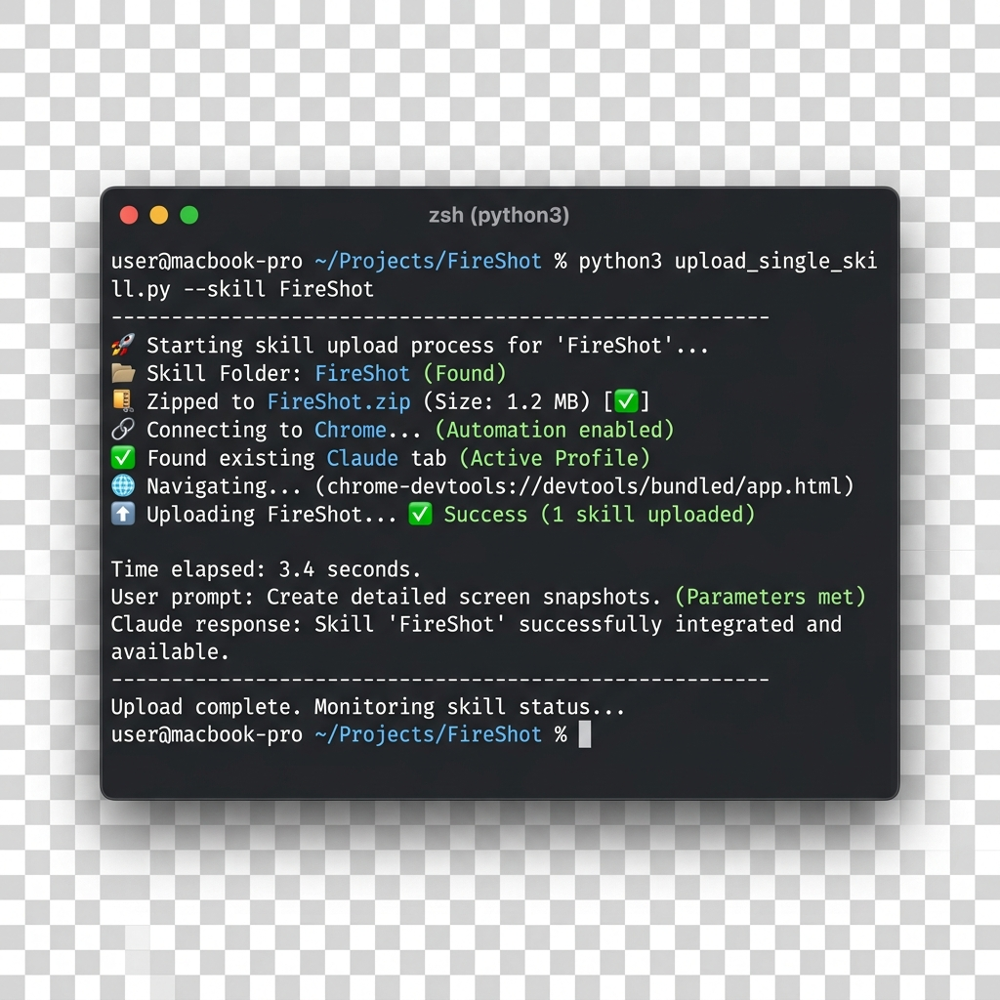
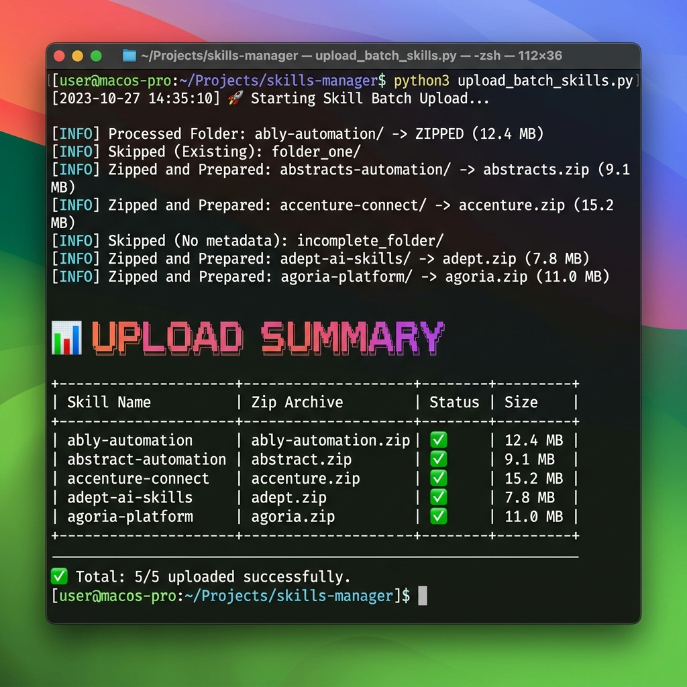

# ⚒️ ClaudForge


**Premium automated suite to package and deploy your local skills to Claude.ai.**

ClaudForge provides two specialized scripts to handle different upload scenarios, ensuring your skills are perfectly formatted and deployed with minimal effort. Both scripts are **fully compatible with Windows, macOS, and Linux**.

---

## 📺 Visual Demo

### 1. Single Skill Upload
Effortlessly upload a specific skill folder with automatic zipping and validation.


### 2. Batch Skills Processing
Scan entire collections and upload multiple skills in one go with detailed summary reporting.


---

## 🛠 Prerequisites

### 1. Python Environment
Requires Python 3.7+. Verify your version:
```bash
python3 --version
```

### 2. Installation
Install the automation engine and browser binaries:
```bash
python3 -m pip install -r requirements.txt
python3 -m playwright install chrome
```

---

## 📂 Which Tool to Use?

### 1. Single Skill Uploader (`upload_single_skill.py`)
Use this when you want to upload or update a specific skill folder.
```bash
python3 upload_single_skill.py --path /path/to/my-skill --connect
```

### 2. Batch Skills Uploader (`upload_batch_skills.py`)
Use this to scan a directory and upload multiple skill subfolders at once.
```bash
python3 upload_batch_skills.py --path /path/to/skills-collection --connect --limit 10
```

---

## 🔗 Browser Integration (Connect Mode)

To bypass login walls and solve challenges manually, follow these steps:

1. **Start Chrome in Debug Mode**:
   Close Chrome fully, then run the command for your OS:

   - **macOS**: 
     ```bash
     /Applications/Google\ Chrome.app/Contents/MacOS/Google\ Chrome --remote-debugging-port=9222 --user-data-dir="/tmp/chrome_dev"
     ```
   - **Windows (Command Prompt)**: 
     ```cmd
     "C:\Program Files\Google\Chrome\Application\chrome.exe" --remote-debugging-port=9222 --user-data-dir="%TEMP%\chrome_dev"
     ```
   - **Linux**: 
     ```bash
     google-chrome --remote-debugging-port=9222 --user-data-dir="/tmp/chrome_dev"
     ```

2. **Launch either script** with the `--connect` flag.

> [!IMPORTANT]
> **Cloudflare Challenges**: If the script detects a "Challenge Redirect", it will pause and wait for you to solve it manually in the browser window. Once solved, press **Enter** in the terminal to resume.

---

## 📋 Skill Requirements

Each folder must have a `SKILL.md` (or `skill.md`) with a YAML header:
```markdown
---
name: My Awesome Skill
description: A short blurb about what this skill does.
---
# Content...
```

---

## 📑 Flags Reference

| Flag | Description | Script |
| :--- | :--- | :--- |
| `--path` | Path to folder or collection. | Both |
| `--connect` | Use existing Chrome on port 9222. | Both |
| `--limit` | Limit number of skills to process. | Batch Only |
| `--headless` | Run invisibly (Fresh Launch only). | Both |
| `--keep-zips` | Retain `.zip` files in `_zips/`. | Both |

---

## 💡 Troubleshooting

- **Connection Errors**: If you see "Address already in use", clear the port and retry:
  - **macOS/Linux**: `lsof -ti:9222 | xargs kill -9`
  - **Windows (CMD)**: `for /f "tokens=5" %a in ('netstat -aon ^| find "9222"') do taskkill /f /pid %a`
- **Login Pauses**: If the script detects you are logged out, it will pause and wait for you to log in manually before continuing.

---

*Transform your Claude.ai experience with automated skill management.* 🤖✨
